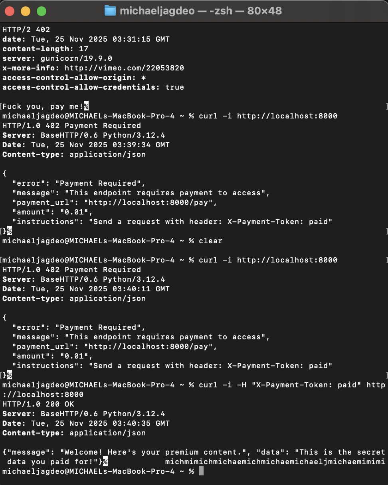

# x402 Quickstart

A collection of practical tools and examples for HTTP requests, payment-gated APIs, text analysis, and exploring the original vision of the web.



## Project Structure

```
x402-quickstart-for-noobs/
├── readme.md                    # This file
├── requirements.txt             # Python dependencies
├── test_api_key.py             # OpenAI API key tester
├── server_402.py               # Simple 402 Payment Required demo server
├── server_pdf_402.py           # PDF server with 402 payment gating
├── extract_text.py             # Extract text from PDFs and images
├── screenshot.png              # HTTP 402 demo screenshot
├── x402-payload.pdf            # X402 protocol documentation
├── x402-payload.txt            # Extracted text from PDF
├── chomsky-lens/               # Parts of speech analyzer
│   ├── README.md              # Chomsky Lens documentation
│   └── chomsky-lens-final.html # Self-contained POS tagging app
└── ted-nelson-clone/           # Ted Nelson's original web vision
    ├── README.md               # Ted Nelson materials guide
    ├── writings/               # Original PDFs and images
    └── extracted-text/         # Text files extracted from PDFs/images
```

---

## Root Directory: HTTP & Payment-Gated APIs

### What is an HTTP request? (in plain English)

When your browser (or any program) wants something from a web server, it sends a tiny message called an HTTP request. The server reads it, does something, and sends back an HTTP response.

The most common types of requests (called "methods"):

| Method | What it means | Everyday example |
|--------|---------------|------------------|
| GET | "Please give me this resource" | Opening a webpage |
| POST | "Here's some data, do something" | Submitting a login form |
| PUT | "Replace this thing with my data" | Updating your profile photo |
| DELETE | "Delete this thing" | Removing a tweet |

### A real HTTP request looks like this (raw text)

```
GET /hello HTTP/1.1
Host: httpbin.org
Accept: text/plain
```

That's literally it. Four lines.

### Hello World you can try in 5 seconds

Open your terminal (Mac/Linux) or PowerShell (Windows) and paste this single line:

```bash
curl -i https://httpbin.org/get
```

You'll instantly see a full HTTP response, including headers and a JSON body.

(curl is just a tool that sends HTTP requests from the command line—it's pre-installed on almost every computer.)

A tiny bit cleaner version (just the important part):

```bash
curl https://httpbin.org/json
```

You should get back something like:

```json
{
  "slideshow": {
    "author": "Yours Truly",
    "date": "date of publication",
    "slides": [
      { "title": "Wake up to WonderWidgets!", "type": "all" },
      { "title": "Overview", "items": ["Why WonderWidgets are great", ...], "type": "all" }
    ],
    "title": "Sample Slide Show"
  }
}
```

Congratulations—you just made your first real HTTP request and got a response!

### Even easier: do it in the browser

Just paste these URLs into your address bar:

- `https://httpbin.org/html` → returns a full HTML page  
- `https://httpbin.org/json` → returns JSON (like above)  
- `https://httpbin.org/status/418` → returns HTTP 418 "I'm a teapot"  
- `https://httpbin.org/anything` → echoes back whatever you send it

### HTTP 402 Payment Required

HTTP 402 is a reserved status code meaning "Payment Required". It's rarely used in practice, but it's perfect for understanding how payment-gated APIs work.

#### Test 402 with curl

You can test a 402 response using httpbin:

```bash
curl -i https://httpbin.org/status/402
```

You'll see:
```
HTTP/1.1 402 Payment Required
...
```

#### See the full response

To see headers and understand what a 402 response looks like:

```bash
curl -v https://httpbin.org/status/402
```

The `-v` (verbose) flag shows you:
- The request headers being sent
- The response status line (`HTTP/1.1 402 Payment Required`)
- All response headers
- The response body (if any)

#### What happens in practice

When a server returns 402, it's saying: "This resource requires payment. Here's what you need to do to access it."

A typical 402 response might include:
- Payment instructions in the response body
- A link to a payment endpoint
- Information about what payment method is accepted

Example curl request that might receive 402:

```bash
curl -i https://api.example.com/premium-content
```

If you haven't paid, you might get:
```
HTTP/1.1 402 Payment Required
Content-Type: application/json

{
  "error": "Payment required",
  "payment_url": "https://api.example.com/pay",
  "amount": "0.01"
}
```

#### Handle 402 programmatically

In a real application, you'd check the status code and handle it:

```bash
# Check if status is 402
curl -s -o /dev/null -w "%{http_code}" https://httpbin.org/status/402
# Output: 402
```

#### Local 402 server example

Run a local server that demonstrates 402:

```bash
python3 server_402.py
```

Then in another terminal, test it:

```bash
# Without payment - gets 402
curl -i http://localhost:8000

# With payment token - gets 200
curl -i -H "X-Payment-Token: paid" http://localhost:8000
```

The first request returns 402 with payment instructions. The second request (with the payment header) returns 200 with the content.

#### PDF Server with 402 Payment Gating

Serve a PDF file that requires payment:

```bash
python3 server_pdf_402.py
```

Then test it:

```bash
# Without payment - gets 402
curl -i http://localhost:8001

# Download PDF with payment token
curl -H "X-Payment-Token: paid" http://localhost:8001 -o downloaded.pdf
```

### Super-minimal "Hello World" server you can run locally

Save this as `server.py` and run `python server.py` (requires Python 3):

```python
from http.server import BaseHTTPRequestHandler, HTTPServer

class Handler(BaseHTTPRequestHandler):
    def do_GET(self):
        self.send_response(200)
        self.send_header("Content-type", "text/plain")
        self.end_headers()
        self.wfile.write(b"Hello World from your own server!\n")

print("Server running at http://localhost:8000")
HTTPServer(("", 8000), Handler).serve_forever()
```

Now open `http://localhost:8000` in your browser → "Hello World from your own server!"

Test it with curl:

```bash
curl http://localhost:8000
```

### Testing Your OpenAI API Key

Before you can use OpenAI's API, you need to set up and test your API key. Here's how:

#### Setup

1. **Install dependencies:**

```bash
pip install -r requirements.txt
```

2. **Create a `.env` file** in the project root with your OpenAI API key:

```
OPENAI_API_KEY=sk-your-actual-key-here
```

**⚠️ Important:** The `.env` file is excluded from git (see `.gitignore`). Never commit API keys or secrets!

#### Test the API Key

Run the test script to verify your API key is working:

```bash
python3 test_api_key.py
```

The script will:
- Load your API key from the `.env` file
- Validate that the key exists and isn't empty
- Make a test API call to OpenAI to verify the key is valid
- Display success or error messages

If successful, you'll see:
```
✓ Found API key: sk-xxxxx...xxxx
Testing API key...
✓ API key is valid!
✓ Successfully connected to OpenAI API
✓ Available models: X models found
```

If there's an error, the script will tell you what went wrong (missing key, invalid key, network issue, etc.).

---

## Chomsky Lens: Parts of Speech Analyzer

A self-contained HTML application for color-coding parts of speech in text using the full WordNet dictionary (29,993 words).

### Quick Start

Simply open `chomsky-lens/chomsky-lens-final.html` in any web browser—no server or dependencies required.

### Features

- **Self-contained** - Single HTML file with embedded WordNet dictionary
- **Color-coded POS tagging** - Nouns (blue), Verbs (green), Adjectives (red), Adverbs (orange), Prepositions (purple)
- **Full WordNet integration** - 8,429 verbs, 17,863 adjectives, 3,630 adverbs
- **Smart noun detection** - Detects capitalized words and common nouns
- **Offline-capable** - Works without internet connection

### Dictionary Statistics

The embedded dictionary contains:
- **Verbs**: 8,429 words
- **Adjectives**: 17,863 words
- **Adverbs**: 3,630 words
- **Prepositions**: 71 words
- **Total**: 29,993 words

### Usage

1. Open `chomsky-lens/chomsky-lens-final.html` in any modern web browser
2. Paste your transcript into the text area
3. Click "Process Transcript" to see color-coded output
4. Click "List All Colored Words" to see all highlighted words by category
5. Click "Clear" to reset

See [`chomsky-lens/README.md`](chomsky-lens/README.md) for full documentation.

---

## Ted Nelson's Original Vision

This project includes a collection of Ted Nelson's seminal works on hypertext and the original vision of the web.

### Overview

Ted Nelson coined the term "hypertext" and envisioned a web where:
- Every document could link to any other document
- Authors could receive micropayments for their content
- Information could be transcluded (embedded) rather than copied
- Version control was built into the system

### Extract Text from PDFs and Images

To extract text from PDFs and images in the project:

```bash
python3 extract_text.py
```

This will process all PDFs and images and save extracted text to `ted-nelson-clone/extracted-text/`.

### Materials Included

- **Computer Lib / Dream Machines** - Nelson's foundational work on personal computing
- **Literary Machines** - The hypertext manifesto
- **Geeks Bearing Gifts** - History of computing and hypertext
- **Project Xanadu** - The original hypertext system design

See [`ted-nelson-clone/README.md`](ted-nelson-clone/README.md) for full details and reading guides.

---

## Security Note

**Never commit secrets!** The `.gitignore` file excludes:
- `.env` files
- `*.env` files
- `thirdweb.env`
- All environment variable files

Always use `.env.example` as a template and keep actual secrets in `.env` files that are git-ignored.

---

That's literally all you need to understand before we layer anything fancy (headers, authentication, payments, etc.) on top. When you're ready, just say "okay, now let's add the first tiny bit of payment magic" and we'll take the next baby step—no rush.
