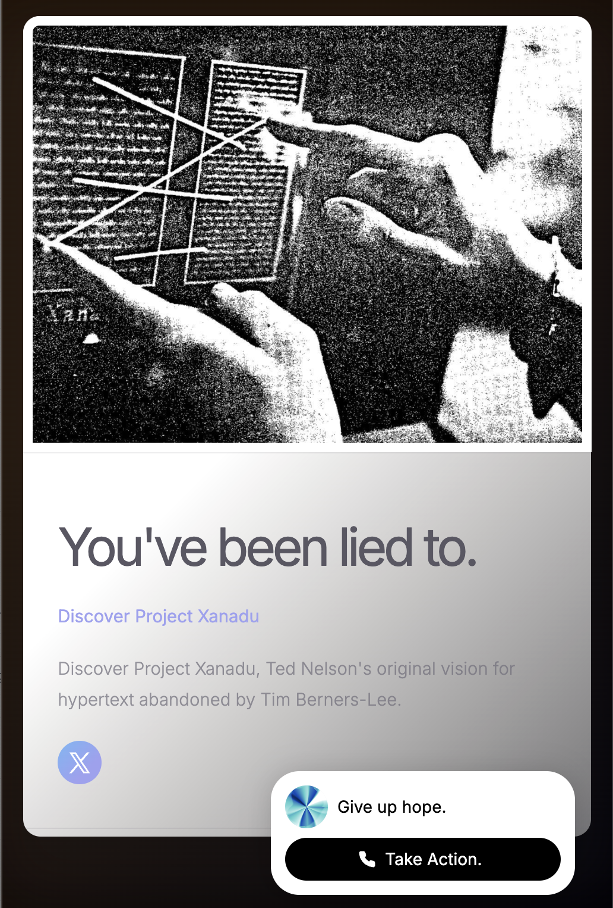

** Chat with Ted https://tednelson.carrd.co/ **



# Ted Nelson's Original Vision of the Web

This directory contains Ted Nelson's seminal works on hypertext, the web, and his original vision for interconnected information systems. All materials have been extracted to text format for easy exploration and learning.

## Project Structure

```
ted-nelson-clone/
├── writings/              # Original PDFs and images
│   ├── Ted Nelson - Computer Lib - Dream Machines.pdf (61MB)
│   ├── nelson-computer-lib-machines.pdf (14MB)
│   ├── LiteraryMachinesChapter2-nelson.pdf (2.9MB)
│   ├── geeks-bearing-gifts-nelson-book.pdf (296KB)
│   └── ted-nelson-excerpt-image.png (1.1MB)
│
└── extracted-text/        # Text files extracted from PDFs and images
    ├── dream-machines-ted-nelson.txt (1.3MB)
    ├── nelson-computer-lib-machines.txt (1.1MB)
    ├── LiteraryMachinesChapter2-nelson.txt (76KB)
    ├── geeks-bearing-gifts-nelson-book.txt (67KB)
    └── the-hypertext-ted-nelson.txt (2.4KB)
```

## Contents

### Original Writings (`writings/`)

The source materials in their original format:

- **Ted Nelson - Computer Lib - Dream Machines.pdf** (61MB) - The iconic dual book from 1974
- **nelson-computer-lib-machines.pdf** (14MB) - Computer Lib / Dream Machines (alternate version)
- **LiteraryMachinesChapter2-nelson.pdf** (2.9MB) - Chapter 2 from Literary Machines
- **geeks-bearing-gifts-nelson-book.pdf** (296KB) - Geeks Bearing Gifts
- **ted-nelson-excerpt-image.png** (1.1MB) - Excerpt image from Ted Nelson's work

### Extracted Text Files (`extracted-text/`)

All PDFs and images have been converted to searchable text files:

- **dream-machines-ted-nelson.txt** (1.3MB) - Full text from Computer Lib / Dream Machines
- **nelson-computer-lib-machines.txt** (1.1MB) - Computer Lib / Dream Machines (alternate version)
- **LiteraryMachinesChapter2-nelson.txt** (76KB) - Literary Machines Chapter 2
- **geeks-bearing-gifts-nelson-book.txt** (67KB) - Geeks Bearing Gifts
- **the-hypertext-ted-nelson.txt** (2.4KB) - OCR text from Ted Nelson excerpt image

## Ted Nelson's Vision

Ted Nelson coined the terms "hypertext" and "hypermedia" and envisioned:

- **Non-sequential writing** - Documents that branch and allow choice to the reader
- **Transclusion** - The same content appearing in multiple places
- **Versioning** - Tracking changes and maintaining document history
- **Micropayments** - Paying for content as you access it (Xanadu project)
- **Two-way links** - Links that work in both directions, showing what links to what

## For Hackathon Participants

These texts are provided to help you understand:
- The original vision of hypertext and the web
- How payment systems were envisioned from the start
- The difference between what was imagined and what we built
- Inspiration for building better, more interconnected systems

## Related Concepts

- **HTTP 402 Payment Required** - A status code reserved for digital payment systems
- **X402 Protocol** - Modern implementation of payment-required content delivery
- **Micropayments** - Small payments for individual pieces of content

## Usage

To extract text from additional PDFs or images, use the `extract_text.py` script in the parent directory:

```bash
python3 extract_text.py
```

---

*"The purpose of computers is human freedom."* - Ted Nelson
